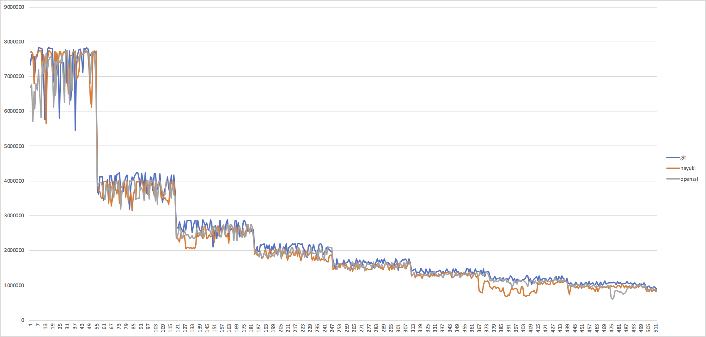

# Some benchmarks of various SHA1 implementations at various input lengths

## Building and running

Build via:
```
make
```

Run via:
```
./bench-openssl
./bench-git
./bench-nayuki
```

## Result notes:

All 3 implementations have similar performance at the tested input sizes 1 bytes -> 512 bytes

All 3 implementations exhibit performance drops at increasing input block size multiples (512 bits / 64 bytes), though a bit surprisingly not exactly at the boundary but 9 bytes prior:

 * (1*64) - 9 = 55
 * (2*64) - 9 = 119
 * (3*64) - 9 = 183
 * (4*64) - 9 = 247

As visualized here:


